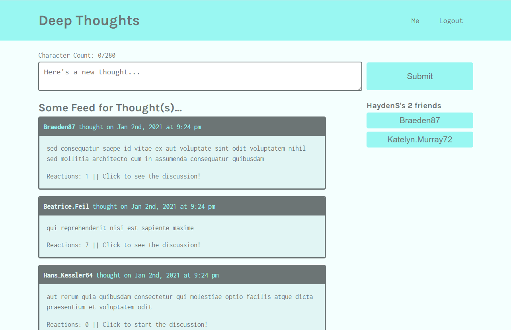

# Deep Thoughts

## Project Description

This project sets up an application where users can create an account, share thoughts, and comment on other thoughts.  The project is built using the MERN stack - MongoDB, Express.js, React, and Node.

## Tools Used

* Create React App
* React
* Node.js
* Javascript ES5 and ES6
* HTML and CSS

## Deployed Application

The application is deployed on Heroku: https://agile-ridge-45235.herokuapp.com/ 

## Screenshot

